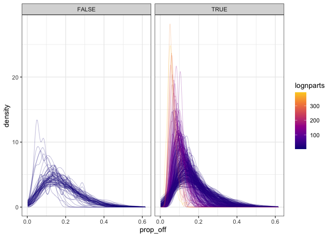

SAD space report
================

Number of comparisons

    ## Warning: Removed 123 rows containing missing values (geom_point).

The region of interest is down where lognparts &lt; 10. These FS also have fewer comparisons (because they are smaller). We will look at results summarized from all comparisons and from subsampled to an equal, small number of comparisons for all communities. We can use the subsampled diffs to look at density plots, etc as well.

All comparisons:

Not shown, but the r2 relationships (log and not) get more off for very low values of mean r2 and mean r2 (log). Very low meaning, r2 &lt; 0 and r2\_log &lt; -1.

    ## Warning: Removed 82 rows containing missing values (geom_point).

    ## Warning: Removed 74 rows containing missing values (geom_point).

    ## Warning: Removed 1 rows containing missing values (geom_point).

The summary stats from the subsampled comparisons are closely related to the non-subsampled comparisons, but there is motion when we subsample.

Subsampling allows us to plot the density plots for these various stats...

### R2

For R2, I have filtered out sim comparisons where r2 &lt; -1. r2 gets as low as -8000, but most of the variation we are interested in is in the 0-1 range.

These extreme r2 values make it impossible to see what we are looking for in these plots. They are rare and concentrated in the very smallest communities. Excluding them, if anything, makes the density estimates for those communities *more* pointed than they would be if they were included. I have re-subsampled the remaining draws so there are the same number of comparisons represented for every community.

Other cutoffs, including 0, don't change the qualitative outcome.

Larger FS are dramatically more concentrated with high r2.

### R2 with log

Similarly, I've removed draws where r2\_log &lt;= -2. Changing the cutoff doesn't change the outcome...

...which is, a concentration at higher r2 for larger FS.

### CD

This is the coefficient of determination from a lm fitting one element of a FS to another. It is bounded 0-1.

Again!

### Proportion off

This is the proportion of individuals who are allocated differently in two FS. It is bounded 0-1.

Again! This time, the large FS have fewer individuals allocated differently (proportional to the number of individuals in the community)

### K-L divergence

This is an estimate of the Kullbak-Lieber (sp) divergence between two elements of the FS.

AGAIN.
