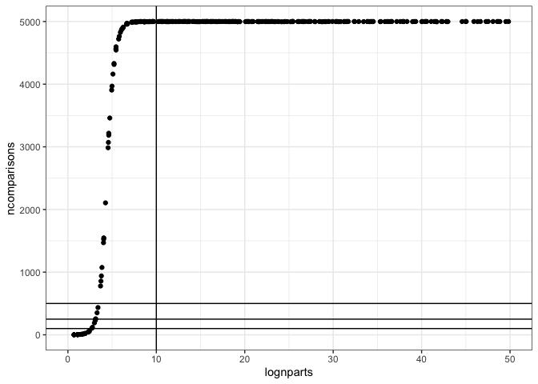
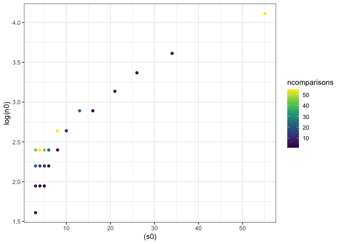

SAD space report
================

Number of comparisons

    ## Warning: Removed 60 rows containing missing values (geom_point).

The region of interest is down where lognparts &lt; 10. These FS also have fewer comparisons (because they are smaller). We will look at results summarized from all comparisons and from subsampled to an equal, small number of comparisons for all communities. We can use the subsampled diffs to look at density plots, etc as well.

All comparisons:

Not shown, but the r2 relationships (log and not) really go haywire for very low values of mean r2 and mean r2 (log). Very low meaning, r2 &lt; 0 and r2\_log &lt; -1.

    ## Warning: Removed 24 rows containing missing values (geom_point).

    ## Warning: Removed 17 rows containing missing values (geom_point).

The summary stats from the subsampled comparisons are closely related to the non-subsampled comparisons, but there is motion when we subsample.

Subsampling allows us to plot the density plots for these various stats...

-   Consider seeing if FS become more concentrated far from even (hoover)
