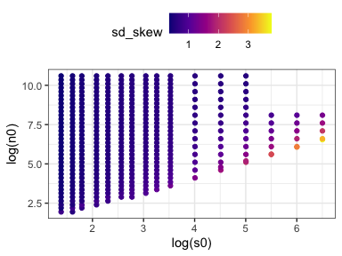
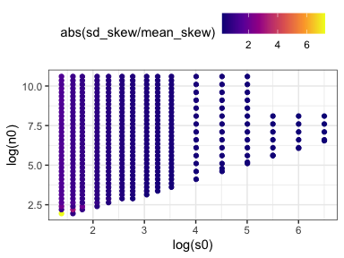
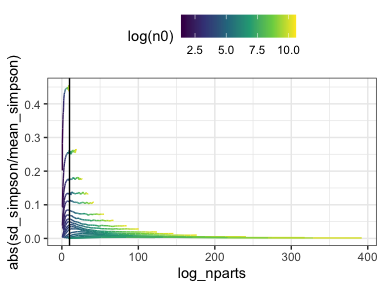

SAD space report
================

Here is the range of S and N space covered, and nparts in FS:

This is *on a log scale*, so up in that right corner is *1.942426e+130*.

Note that the number of elements *would* continue to increase along each of these lines, except we hit the edge of the sampling space.

Here is the number of unique FS found, and the number of unique FS over the number that exist. Note that the number of draws was 5,000, so the maximum possible log(nunique) would be `8.5171932`. FS that found 5,000 unique draws are covered with black dots in this plot:

Here is the number of unique samples found relative to the number possible. FS that found all the elements possible are covered with green dots:

Skewness behavior
-----------------

Both skewness and the variability in skewness decrease with N/S, and increase with S. For a given S, a higher N/S (so higher N) will have lower skew and lower variability.

I don't think it matters very much whether you look at mean or median/range or sd.

Simpson behavior
----------------

Overlap with datasets represented in `scadsanalysis`
----------------------------------------------------

the sharpness of the threshold is an artifact of the way we don't have a lot of low s/high n communities in the datasets we started with.
