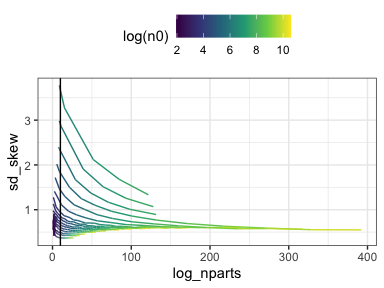
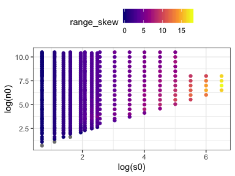
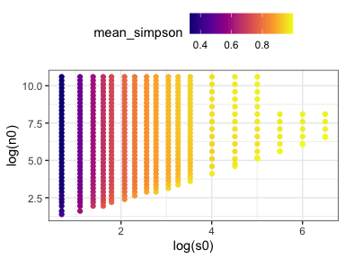
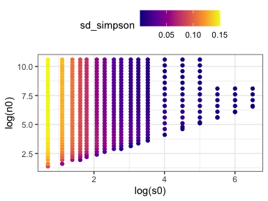
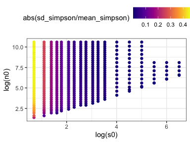
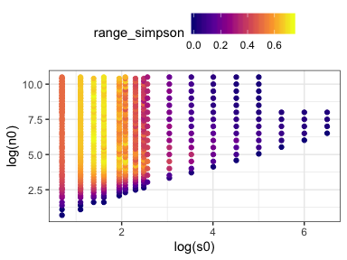
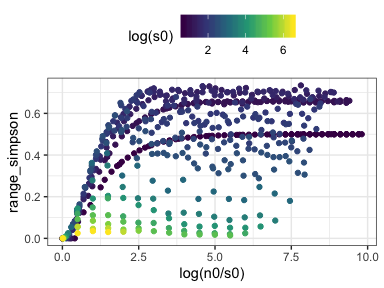

SAD space report
================

Here is the range of S and N space covered:


Things are generally easier to see on the log axis, so let's stick with that.

Size and unique elements from FS
--------------------------------

Here is how the size of the feasible set varies with S, N, and N/S:


This is *on a log scale*, so up in that right corner is *1.942426e+130*.


Note that the number of elements *would* continue to increase, except we hit the edge of the sampling space.

Here is the number of unique FS found, and the number of unique FS over the number that exist. Note that the number of draws was 10,000, so the maximum possible log(nunique) would be 9.2. FS that found 10,000 unique draws are covered with black dots in this plot:


Here is the number of unique samples found relative to the number possible. FS that found all the elements possible are covered with green dots:


Skewness behavior
-----------------

<!-- ```{r summary df} -->
<!-- di_summary_df <- di_df %>% -->
<!--   group_by(s0, n0, nparts, nunique) %>% -->
<!--   summarize(mean_skew = mean(skew, na.rm = T), -->
<!--             sd_skew = sd(skew, na.rm = T), -->
<!--             range_skew = max(skew, na.rm = T) - min(skew, na.rm = T), -->
<!--             median_skew = median(skew, na.rm = T), -->
<!--             median_simpson = median(simpson, na.rm = T), -->
<!--             mean_simpson = mean(simpson, na.rm = T), -->
<!--             sd_simpson = sd(simpson, na.rm = T), -->
<!--             range_simpson = max(simpson, na.rm = T) - min(simpson, na.rm = T)) %>% -->
<!--   ungroup() %>% -->
<!--   mutate(log_nunique = log(nunique), -->
<!--          log_nparts = log(as.numeric(nparts))) -->
<!-- ``` -->


Simpson behavior
----------------


