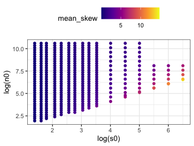
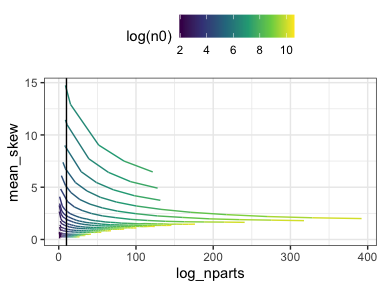
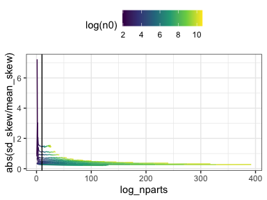
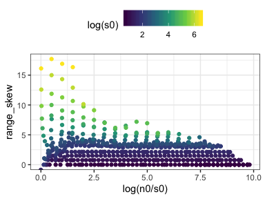
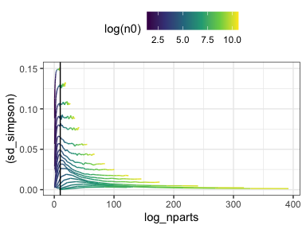
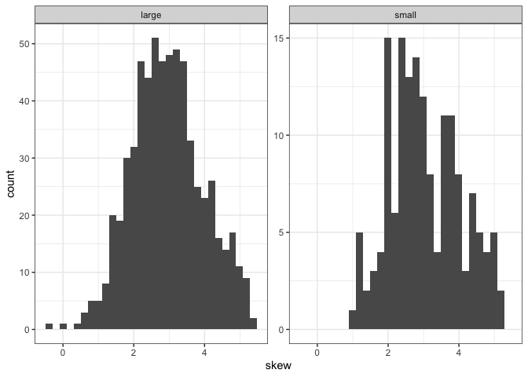
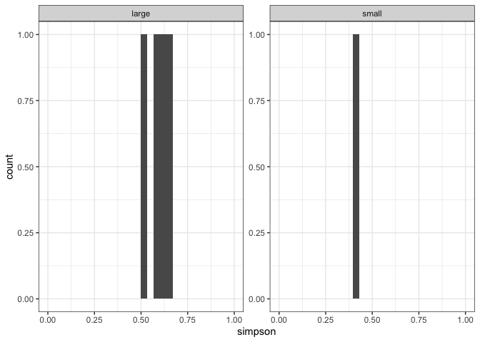
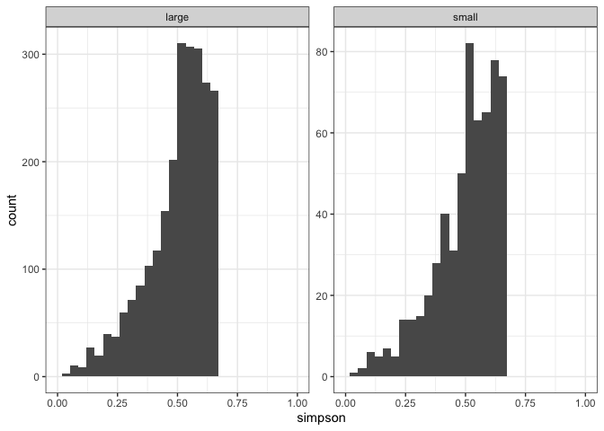

SAD space report
================

Here is the range of S and N space covered:

Things are generally easier to see on the log axis, so let's stick with that.

Size and unique elements from FS
--------------------------------

Here is how the size of the feasible set varies with S, N, and N/S:

This is *on a log scale*, so up in that right corner is *1.942426e+130*.

Note that the number of elements *would* continue to increase, except we hit the edge of the sampling space.

Here is the number of unique FS found, and the number of unique FS over the number that exist. Note that the number of draws was 10,000, so the maximum possible log(nunique) would be 9.2. FS that found 10,000 unique draws are covered with black dots in this plot:

Here is the number of unique samples found relative to the number possible. FS that found all the elements possible are covered with green dots:

Skewness behavior
-----------------

Both skewness and the variability in skewness decrease with N/S, and increase with S. For a given S, a higher N/S (so higher N) will have lower skew and lower variability.

I don't think it matters very much whether you look at mean or median/range or sd.

This behavior is a little hard to understand - why should high N communities have *lower* skew? Let's look more closely at a few communities.

These are the communities we'll pull out:

It looks like

-   Skewness depends largely on S. Higher S creates the possibility of having higher skew values. N doesn't change too much. I suspect that increasing N increases the abundance of not-the-most-skewed vectors, which is why the means and variability are lower.
-   Within a FS, skewness broadly tracks intuition.

So, I wouldn't interpret too heavily from skewness values from distributions with vastly different S and N.

Simpson behavior
----------------

Simpson is generally higher as S increases; it doesn't seem to change too much with N on top of the S change - if anything, it decreases with N for a given S. Variability is high for low S.

Let's look at those same heatmaps for Simpson's:

Simpson gets EXTREMELY HIGH for large S and to a lesser extent large N communities.

Simpson for different S and N, and especially different S, are NOT COMPARABLE.

Distributions of skewness and simpson w nsamples
------------------------------------------------

    ## `stat_bin()` using `bins = 30`. Pick better value with `binwidth`.

    ## `stat_bin()` using `bins = 30`. Pick better value with `binwidth`.

    ## `stat_bin()` using `bins = 30`. Pick better value with `binwidth`.

    ## `stat_bin()` using `bins = 30`. Pick better value with `binwidth`.

    ## `stat_bin()` using `bins = 30`. Pick better value with `binwidth`.

    ## `stat_bin()` using `bins = 30`. Pick better value with `binwidth`.

    ## `stat_bin()` using `bins = 30`. Pick better value with `binwidth`.

    ## `stat_bin()` using `bins = 30`. Pick better value with `binwidth`.

    ## Warning: Removed 4 rows containing missing values (geom_bar).

    ## `stat_bin()` using `bins = 30`. Pick better value with `binwidth`.

    ## Warning: Removed 4 rows containing missing values (geom_bar).

    ## `stat_bin()` using `bins = 30`. Pick better value with `binwidth`.

    ## Warning: Removed 4 rows containing missing values (geom_bar).

    ## `stat_bin()` using `bins = 30`. Pick better value with `binwidth`.

    ## Warning: Removed 4 rows containing missing values (geom_bar).

    ## `stat_bin()` using `bins = 30`. Pick better value with `binwidth`.

    ## Warning: Removed 4 rows containing missing values (geom_bar).

    ## `stat_bin()` using `bins = 30`. Pick better value with `binwidth`.

    ## Warning: Removed 4 rows containing missing values (geom_bar).

    ## `stat_bin()` using `bins = 30`. Pick better value with `binwidth`.

    ## Warning: Removed 4 rows containing missing values (geom_bar).

 OK, I feel good that the sim index is unrelated to the value, and that increasing the nb of sims only increases resolution, not shape.
