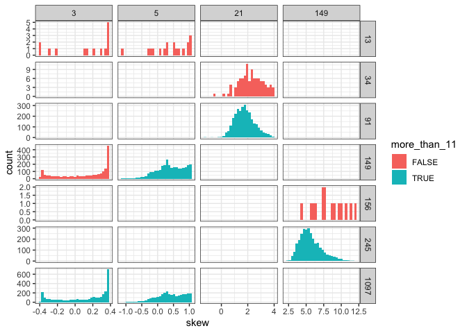

SAD space report
================

Here is the range of S and N space covered:

Things are generally easier to see on the log axis, so let's stick with that.

Size and unique elements from FS
--------------------------------

Here is how the size of the feasible set varies with S, N, and N/S:

This is *on a log scale*, so up in that right corner is *1.942426e+130*.

For now I am interested in lognparts up to about 20

These are the communities we'll pull out:

    ## Warning in bind_rows_(x, .id): Unequal factor levels: coercing to character

    ## Warning in bind_rows_(x, .id): binding character and factor vector, coercing
    ## into character vector

    ## Warning in bind_rows_(x, .id): binding character and factor vector, coercing
    ## into character vector

    ## Warning in bind_rows_(x, .id): binding character and factor vector, coercing
    ## into character vector

    ## Warning in bind_rows_(x, .id): Unequal factor levels: coercing to character

    ## Warning in bind_rows_(x, .id): binding character and factor vector, coercing
    ## into character vector

    ## Warning in bind_rows_(x, .id): binding character and factor vector, coercing
    ## into character vector

    ## Warning in bind_rows_(x, .id): binding character and factor vector, coercing
    ## into character vector

    ## Warning in bind_rows_(x, .id): binding character and factor vector, coercing
    ## into character vector

    ## Warning in bind_rows_(x, .id): binding character and factor vector, coercing
    ## into character vector

    ## Warning in bind_rows_(x, .id): binding character and factor vector, coercing
    ## into character vector

    ## Warning in bind_rows_(x, .id): binding character and factor vector, coercing
    ## into character vector

    ## Warning in bind_rows_(x, .id): binding character and factor vector, coercing
    ## into character vector

    ## Warning in bind_rows_(x, .id): binding character and factor vector, coercing
    ## into character vector

    ## Warning in bind_rows_(x, .id): binding character and factor vector, coercing
    ## into character vector

    ## Warning in bind_rows_(x, .id): binding character and factor vector, coercing
    ## into character vector

    ## Warning in bind_rows_(x, .id): binding character and factor vector, coercing
    ## into character vector

    ## Warning in bind_rows_(x, .id): binding character and factor vector, coercing
    ## into character vector

    ## Warning in bind_rows_(x, .id): binding character and factor vector, coercing
    ## into character vector

    ## Warning in bind_rows_(x, .id): binding character and factor vector, coercing
    ## into character vector

Here are the FS of those distributions:

Here are histograms of skew/even for these distributions:

    ## `stat_bin()` using `bins = 30`. Pick better value with `binwidth`.

    ## `stat_bin()` using `bins = 30`. Pick better value with `binwidth`.

